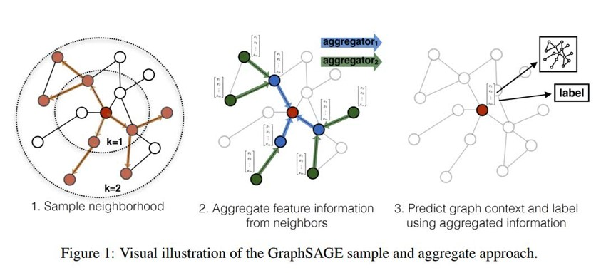

# 图卷积神经网络——GCN

GNN模型主要研究图节点的表示（Graph Embedding），图边结构预测任务和图的分类问题，后两个任务也是基于Graph Embedding展开的。首先了解图结构是什么，最一般它是由节点和无向边构成的，一般我们称之为无向图。由于拓扑图中每个顶点的相邻顶点数目都可能不同，无法用一个同样尺寸的卷积核来进行卷积运算。GCN借助拉普拉斯矩阵来研究图的性质，通过傅里叶变换进行图上的卷积操作。

整体认识一下什么是GCN网络。图卷积神经网络的输入为拓补图，在一Convolution Layer里，对每个结点的邻居都进行一次卷积操作，并用卷积的结果更新该结点，则该节点具备其相邻节点及其自身的特征信息．在使用激活函数后可添加多个Convolution Layer构成深度神经网络．可将最终每个结点的状态转化为任务相关的标签用于分类任务，也可利用结点的信息得到整张图的表示。

**GCN的四个特征：**

- GCN 是对卷积神经网络在 graph domain 上的自然推广
- 它能同时对节点特征信息与结构信息进行端对端学习，是目前对图数据学习任务的最佳选择。
- 图卷积适用性极广，适用于任意拓扑结构的节点与图。
- 在节点分类与边预测等任务上，在公开数据集上效果要远远优于其他方法。

### 1. 传统卷积与图卷积

CNN中的卷积本质上就是利用一个共享参数的过滤器（kernel），**通过计算中心像素点以及相邻像素点的加权和来构成feature map实现空间特征的提取**，当然加权系数就是卷积核的权重系数。

那么卷积核的系数如何确定的呢？是随机化初值，然后根据误差函数通过反向传播梯度下降进行迭代优化。这是一个关键点，**卷积核的参数通过优化求出才能实现特征提取的作用，GCN的理论很大一部分工作就是为了引入可以优化的卷积核参数。**
　　

如图为应用在图像（欧式空间）和图（非欧式空间）的卷积区别。
其中可以看到，在图像为代表的欧式空间中，结点的邻居数量都是固定的；但在图中节点有多少邻居节点并不固定。这种特性在图像领域称为**平移不变性(translational invariance)**。
欧式空间中的卷积操作实际上是用固定大小的可学习的卷积核来抽取特征；而图邻居节点不固定，故不可以。**因此图卷积的本质是想找到适合图的可学习卷积核。**

### 2. 图卷积
**图卷积方式主要分为两大类：空域卷积和频(谱)域卷积**。其中频域卷积主要是根据图谱理论和卷积定理，将数据由空域转换到谱域做处理，它有较为坚实的理论基础。而空域卷积则不依靠图谱卷积理论，直接在空间上定义卷积操作，它的定义直观，灵活性比较强。这里给出近年来图卷积的发展状况，后续我们重点介绍图谱卷积中的经典模型，对于最新的研究进展和空域图卷积的具体工作，读者可根据下图具体展开学习。

#### 2.1 空域卷积(Spatial Convolution)
空域卷积与深度学习卷积的应用方式类似，直接将卷积定义在每个节点的连接关系上，核心在于聚合邻居结点的信息。这种方式要直接在空域上对节点的相邻节点来操作，所有设计难点在于要定义拥有不同邻居数量的卷积操作。比如一种最简单的无参卷积方式可以是将所有直连邻居结点的状态信息加和，来更新当前结点的状态信息。

空域图卷积没有涉及太多的数学知识，我们以四类经典模型展开简要介绍，具体的工作细节可查找相应论文。
**(1) GNN(A Generalization of Convolutional Neural Networks to Graph-Structured Data)**

GNN认为卷积就是固定数量领域节点排序后，与相同数量的卷积核参数相乘就和。实际就是说，GNN将卷积分为两步，第一步**构建邻域**，第二步**对邻域上的节点与卷积核参数进行内积操作**。比如说，对于图像卷积，第一步我们对于一个节点会构建一个3x3的邻域（像素间为8邻域的结构），同时这个邻域有从左上角到右下角的固有顺序；第二步卷积核参数与邻域上信号进行内积。然而图结构不存在固定8邻域结构，且同一邻域节点不存在顺序，因此主要难点在第一步构建邻域，即怎么找固定数量的邻居节点，找到的邻居节点如何排序。
GNN解决思路：使用**随机游走**方法，根据被选中的概率期望大小选择固定数量的邻居节点（具体设计到马尔科夫模型的相关知识）。然后根据节点被选择的概率期望来对邻域排序。本质上说，GNN做法是强制将一个图结构数据变化为了一个类似规则的数据，从而可以被1D卷积处理。

**(2) GraphSAGE(Inductive Representation Learning on Large Graphs)**

GraphSAGE认为卷积是**采样+聚合**，第一步通过采样得到邻域节点；第二步使用聚合函数聚合邻居节点信息，获得目标节点的embedding；第三步利用节点上聚合得到的信息来预测节点/图的label(这一步属于网络输出层的工作)。

上图展示了实现卷积的三个步骤。采样时，GraphSAGE采用均匀采样法来采样固定的邻域节点，即对于某一节点，在其k阶相连节点上均匀采样以构建固定节点数量的邻域，每次迭代都会进行采样，因此相同节点邻居可能发生变化。对于聚合作者提供了三种聚合函数：均值聚合；LSTM聚合；Pooling(池化)聚合。

与GNN不同之处在于：
* 在GNN(以及传统CNN)中需要确定邻域节点顺序，但GraphSAGE认为邻域节点不需要排序。
* 在GNN中邻域里的每个节点拥有不同的卷积核参数，但在GraphSAGE中邻域里所有节点共享同样的卷积核参数。
* 邻域选择上，GNN利用随机游走的概率大小来构建邻域，GraphSAGE通过均匀采样来构建邻域。

**(3) GAT(Graph Attention Networks)**

GAT认为卷积可定义为利用注意力机制(attention机制相关知识)对邻域节点有区别的聚合。核心思想：将attention引入图卷积模型；认为邻域中所有节点共享相同卷积核参数会限制模型能力，因为邻域内的每个节点和中心节点的关联度都是不同的；利用attention机制建模邻域节点与中心节点的关联度。

实现的步骤：(1)使用注意力机制计算节点之间的关联度，这时可以得到中心节点与邻域节点间的权重系数(学习得到)。(2)利用注意力的系数对邻域节点进行有区别的信息的结合，完成图卷积操作。总体来说，基本完全套用attention机制操作流程。

与之前图卷积的比较：
* 不同于GNN、GraphSAGE，GAT直接选用1阶相邻节点作为邻域节点。
* GAT中邻域所有节点无需排序，且共享卷积核参数。
* 由于引入attention，GAT虽然也共享参数，但实际对邻域的每个节点隐式地分配了不同的卷积核参数。

**(4) PGC(Spatial Temporal Graph Convolutional Networks for Skeleton-Based Action Recognition)**

PGC认为卷积是**特定的取样函数**和**特定的权重函数**相乘后求和。对于经典卷积，我们将$K \times K$的卷积核写成下式：
$$
f_{out}(x)=\sum_{h=1}^{K}\sum_{w=1}^{K}f_{in}(p(x,h,w))\cdot w(h,w)
$$
上式中P()为取样函数，即在邻域内依次取出节点，来参与卷积运算；W()为权重函数，即对取出来的节点分配卷积核参数；f()表示将对应点转换为对应的特征。比如说，3x3的卷积核有9个信号，当h=1,w=1时，则取$x_{11}$位置的点，随着h和w的不断变化可以取到这9个点，以上是在经典卷积中对取样函数和权重函数的定义。

PGC为了将卷积从规则数据扩展到图结构数据，需要选择合适的取样函数和权重函数。因此，它为取样函数定义在了D阶近邻的节点上，即对节点的D阶近邻取样。而对于权重函数，它将邻域内的点分为K个不同的类，每一个类共享一个卷积核参数，不同类卷积核参数不同。当K=1则所有节点共享一个卷积核参数类似GraphSAGE，当K=节点数时则每个节点都对应一个卷积核参数类似GNN，因此它取了二者中间态。最终PGC定义在图上卷积公式为：
$$
f_{out}(v_i)=\sum_{v_j \in B(v_i)}\frac{1}{Z_i(v_j)}f_{in}(v_j)w(l_i(v_j))
$$
上式的函数与之前一致，首先是一个取样函数在一阶邻域内依次取样，得到j节点后，之后f将j节点转换成它的特征。之后分配权重，给j节点分类，$l_i$表示分类，即根据不同类别给j节点分配一个不同的权重函数。最后使用一个归一化系数Z，表示j节点所处类的节点数量。

#### 2.2 频域卷积(Spectral Convolution)
空域卷积主要借鉴了图像的卷积操作，缺乏理论基础。而频域卷积不同，它主要利用图傅里叶变换实现卷积。

##### 2.2.1 前置内容
介绍频域卷积前，先引入重要前置内容。

**(1) 图相关矩阵的定义：**
度矩阵 $D$ ：只有对角线有值，为对应节点的度，其余为0
邻接矩阵$A$：有边连接的两节点间为1，其余为0
拉普拉斯矩阵常见有三种(**拉普拉斯矩阵的性质见附录1**) ：

  * $L=D-A$。
  * 归一化拉普拉斯矩阵：$L^{sys}=D^{-1/2}AD^{1/2}$
  * Random walk normalized Laplacian:  $L^{rm}=D^{-1}L$

**(2) 卷积基本概念**
$$(f*g)(t)={\int}_{-\infty}^{\infty}f(\tau)g(t-\tau) d\tau(连续形式)$$
$$(f*g)(t)={\sum}_{\tau=-\infty}^{\infty}f(\tau)g(t-\tau) d\tau (离散形式)$$
它代表的意义，两个函数取g(x),把g(x)经过翻转平移,与f(x)相乘得到新的函数，再对函数积分。

**(3) 傅里叶变换：**
傅里叶变换属于数字信号处理的重要算法，先给出基本定义以及它的变换公式：

  * 傅里叶变换会将一个空域(或时域)上定义的函数分解成频域上若干频率成分。(空域：像素域，每个像素点空间坐标内；频域：自变量是频率，纵轴是信号频率的幅度，图像灰度变化的程度，灰度梯度。)
  * $F(w) = \int_{-\infty}^{\infty}f(x)e^{-iwx}dx$  ，由$f(x)$变换到$F(w)$的结果，其中$i=\sqrt{-1}$  (**傅里叶变换见附录2**)

要想知道我们图卷积为什么要使用傅里叶变换，先看看它的意义：
* 在数字信号处理领域，傅里叶实现了从时域到频域的变换。根据原理我们知道，任何连续周期信号可以由多个的正弦曲线组合而成，可以说，傅里叶变换将原来难以处理的时域信号转化成频域信号。如下图，上为时域信号，下为频域信号，可以看到时域上很混乱而在频域图像非常规律，对于信号处理比如滤波等很轻易在频域实现。
  
* 在图像领域，傅里叶变换实现了从空域到频域的变换。原始图像是在连续空间上采样得到一系列点的集合，比如我们用二维矩阵表示一个图像，经过傅里叶变换，我们能得到图像的频谱图。它代表着图像灰度变化的剧烈程度即灰度梯度，原始图像上颜色差异大，灰度梯度大的地方，对应到频谱图上的高频部分，显示出亮度强。如下图所示，这有利于图像的去噪等。

由上可以看到傅里叶变换可以化繁为简，让我们更好处理和分析原始数据，对于图结构也是如此。现在我们知道了基本卷积定义和傅里叶变换的原理，再介绍下卷积和傅里叶变换非常重要的关系：
$$
(f*g)(t)=\mathcal{F}^{-1}[\mathcal{F}[f(t)]{\odot}\mathcal{F}[g(t)]]
$$
上面是一个卷积恒等式，$\mathcal{F}$表示傅里叶变换，$\mathcal{F}^{-1}$表示傅里叶逆变换,$\odot$表示两个矩阵的逐点乘积。直观的说，就是 **空(时)域卷积等于频域卷积**。因此要计算f和g的卷积，可以先将它们通过傅里叶变换到频域，将两个函数相乘再通过傅里叶逆变换转换出来，得到卷积结果。

##### 2.2.2  推广到图的傅里叶变换

根据上面附录的介绍，我们知道傅里叶变换本质是将函数$f(x)$映射到了以$\{{\exp}^{-iwt}\}$为基向量的空间中。其中，对于这个傅里叶变换的基$e^{-i\omega t}$，是**拉普拉斯算子的特征函数(见附录1)**，$\omega$与特征值相关。
而我们定义这个拉普拉斯算子目的其实就是为了找到傅里叶变换的基，这样若要将傅里叶变换推广到图，我们就需要用一个图上的"拉普拉斯算子"去寻找图的傅里叶变换的基，我们最后找到这个"拉普拉斯算子"就是我们之前介绍过的拉普拉斯矩阵，它也被叫做离散的拉普拉斯算子。(**至于傅里叶变换中的拉普拉斯算子到图上傅里叶变换的拉普拉斯矩阵，见附录3**)

由上所述，我们找到了图上的拉普拉斯算子即拉普拉斯矩阵，所以图上傅里叶变换的基就是拉普拉斯矩阵的特征向量。而通过拉普拉斯矩阵求其特征向量的过程，就是**拉普拉斯矩阵的谱分解(见附录1)**，这也是频域卷积的核心。
最终，我们得出拉普拉斯矩阵$L$的特征向量$V$ ：$LV=\lambda V$。由拉普拉斯矩阵性质得到$L = U{\Lambda}U^{T}$，最后的$U$就是特征矩阵。

再回头看下传统傅里叶公式$F(w) = \int_{-\infty}^{\infty}f(x)e^{-iwx}dx$ ，原函数乘以基的积分形式。
根据离散积分就是内积形式，我们可以得到图的傅里叶变换就是在拉普拉斯矩阵的特征值$\lambda_l$下的$f$与$\lambda_l$对应的特征向量$u_l$的内积。
$F(\lambda_l)=\hat f(\lambda_l) = \sum_{i=1}^N f(i)u_l^{*}(i)$

其中，$f$是图上的N维向量，$f(i)$与图的节点一一对应，$u_l (i)$表示第$l$个特征向量的第i个分量。上述内积运算在复数空间定义，采用$u_l$的共轭$u^{*}_{l}$。
写成矩阵形式为：
$$
\left( \begin{array}{ccc} \hat f(\lambda_1) \\  \hat f(\lambda_2) \\ \vdots & \\ \hat f(\lambda_N) \\ \end{array} \right)  =
\left( \begin{array}{ccc}
u_1(1) & u_1(2) & \ldots & u_1(N) \\
u_2(1) & u_2(2) & \ldots & u_2(N) \\
\vdots & \vdots & \ddots & \vdots & \\
u_N(1) & u_N(2) & \ldots & u_N(N) \\   \end{array}
\right)
\left( \begin{array}{ccc}  f(1) \\   f(2) \\ \vdots & \\  f(N) \\ \end{array} \right)
$$
即$\hat f=U^Tf$

类似的，得到傅里叶逆变换为
$$
\left( \begin{array}{ccc}  f(1) \\   f(2) \\ \vdots & \\  f(N) \\ \end{array} \right)  =
\left( \begin{array}{ccc}
u_1(1) & u_2(1) & \ldots & u_N(1) \\
u_1(2) & u_2(2) & \ldots & u_N(2) \\
\vdots & \vdots & \ddots & \vdots & \\
u_1(N) & u_2(N) & \ldots & u_N(N) \\   \end{array}
\right)
\left( \begin{array}{ccc} \hat f(\lambda_1) \\  \hat f(\lambda_2) \\ \vdots & \\ \hat f(\lambda_N) \\ \end{array} \right)
$$
即$f=U \hat f$

##### 2.2.3 推广到图卷积

我们再列出之前的卷积与傅里叶变换的关系式，两个函数分别傅里叶变换后点积再进行逆变换为：
$$
(f*g)(t)=F^{-1}[F[f(t)]{\odot}F[g(t)]]
$$
我们最终得到推广在图上的卷积：
$$
(f{*}_{G}g)=U(U^Tf{\odot}U^Tg)=U(U^Tg{\odot}U^Tf)
$$
我们把$U^Tg$整体看作可学习的卷积核$g_{\theta}$，表达形式就上面所讲矩阵形式的傅里叶变换，为了能和$U^Tf$进行点积，我们等价写成对角阵形式与$U^Tf$相乘，公式如下
$$
(f*g)_G = U \left( \begin{array}{ccc} \hat g(\lambda_1) & \\ &  \ddots & & \\ & & & \hat g(\lambda_N) \\ \end{array} \right) U^T f=Ug_{\theta}U^Tf
$$

##### 2.2.4 图卷积具体实现

后面介绍图卷积为实际深度学习中应用的图卷积，现在主要应用的是第三代GCN。

**(1) 第一代GCN**(Spectral Networks and Locally Connected Networks on Graphs，SCNN)

由上推导的$g_{\theta}$是首个提出的频域卷积神经网络的卷积核，即把直接把$diag(\hat g(\lambda_l))_{}$作为卷积核。

其中，对于$diag(\hat g(\lambda_l))$，这是深度学习的卷积要设计一个可训练的卷积核，我们对它变换为下面式子，这样不需要将卷积核再进行傅里叶变换，直接用这个变换后的参量学习。
$$
g_{\theta}(\Lambda)=
\left[
 \begin{matrix}
   {\theta}_1 & ... & 0 \\
   ... & ... & ... \\
   0  & ... & {\theta}_N \end{matrix}
  \right]
$$
最终的频域卷积层的更新状态为下式：
$y_{output}=\sigma (U g_{\theta}(\Lambda)U^Tx)$
其中，$\boldsymbol{x}$就是graph上对应每个节点的feature构成的向量，$x=\left(x_{1}, x_{2}, \ldots, x_n\right)$，然后经过激活之后，得到输出$\boldsymbol{y}_{\text {output}}$，之后传入下一层。

问题：
* 计算复杂度高，我们需要对拉普拉斯矩阵进行谱分解，计算复杂度$O(n^3)$，就算完成谱分解，矩阵运算时时间复杂度也高达$O(n^2)$
* 没有空间的局部性，卷积操作是全局操作，并不是源于节点的邻域
* 参数个数O(N)，而传统卷积只有常数

**(2) 第二代GCN**(Convolutional neural networks on graphs with fast localized spectral filtering，ChebNet)

将$\hat g(\lambda_l)$设计成了K阶多项式$\sum_{j=0}^{K} \alpha_j \lambda_l^j$ ，其中$ \alpha_j$为多项式系数也是待学习参数，这样卷积核有了K阶局部性。其中公式展开如下：

$$
y_{output}=\sigma (U  \left( \begin{array}{ccc} \sum_{j=0}^{K} \alpha_j \lambda_1^j & \\ &  \ddots & & \\ & & & \sum_{j=0}^{K} \alpha_j \lambda_n^j \\ \end{array} \right) U^Tx)
$$

根据拉普拉斯矩阵性质，最终可将公式改写为(**详细推导见附录4**)：

$$
y_{output}=\sigma  (\sum_{j=0}^{K} \alpha_j L^j x)
$$

其中$(\alpha_1, \alpha_2, ...,\alpha_K)$是神经网络待学习的参数通过反向传播调整。这样设计卷积核的优点在于：

* 卷积核只有K个参数，一般K远小于n

* 矩阵经过变换后，不需要再对拉普拉斯矩阵做特征分解。当事先计算好$L^k$，每一步只需要向量与矩阵相乘，计算复杂度$O(KN^2)$。

* 卷积核具有很好的空间局部性。由于上式会对拉普拉斯矩阵进行K次乘法计算，而拉普拉斯矩阵表示的是图的一阶近邻关系，K次乘法下的图拉普拉斯矩阵表示图的K阶近邻关系。因此，第二代GCN只考虑了K阶邻域，下图给出了当K=1和2时，某一节点基于邻域信息的更新状态。

此外，第二代GCN利用**切比雪夫多项式**(**公式推导见附录4**)的$K$阶截断来近似上式中的$L^k$，以加快计算速度，最终的卷积公式为：
$$
\boldsymbol{y}_{\text {output}}=\sigma\left(\sum_{k=0}^{K} \theta_{k}^{\prime} T_{k}(\tilde{\boldsymbol{L}}) \boldsymbol{x}\right)
$$

其中，$T_k$表示切比雪夫多项式第k项，$\tilde{\boldsymbol{L}}=\frac{2}{\lambda_{\max }} \boldsymbol{L}-\boldsymbol{I}_{n}$，$\boldsymbol{\theta}^{\prime} \in \mathbb{R}^{K}$为切比雪夫向量，$\theta_{k}^{\prime}$为第$k$个分量与之前的$\alpha$类似，为待学习参数。同样K阶切比雪夫多项式内部也需要计算拉普拉斯矩阵的K次乘法，因此满足考虑图的K阶邻域。

**(3) 第三代GCN**(Semi-Supervised Classification with Graph Convolutional Networks，GCN)

第三代GCN直接取切比雪夫多项式K=1，即只考虑每个节点直接邻域的信息传递。

经过公式推导(**见附录5**)，最终带入卷积公式为，
$$
\underbrace{g_{\theta^{\prime}} * x}_{\mathbb{R}^{n \times 1}}=\theta\left(\underbrace{\tilde{D}^{-1 / 2} \tilde{A} \tilde{D}^{-1 / 2}}_{\mathbb{R}^{n \times n}}\right) \underbrace{x}_{\mathbb{R}^{n \times 1}}
$$

将该公式推广到多通道，即x由$N\times 1$变为$N\times C$，卷积核参数$\theta$由1维变为$C\times F$。其中，N,C,F分别代表节点个数，通道数，卷积核个数。
$$
\underbrace{Z}_{\mathbb{R}^{N \times F}}=\underbrace{\tilde{D}^{-1 / 2} \tilde{A} \tilde{D}^{-1 / 2}}_{\mathbb{R}^{N \times N}} \underbrace{X}_{\mathbb{R}^{N \times C}} \underbrace{\mathbf{\Theta}}_{\mathbb{R}^{C \times F}}
$$

这样，卷积核虽然只考虑到1阶邻域，但增加了卷积核个数堆叠成多层来增加感受野。这个也属于深度学习经验，增加深度比增加宽度效果好。

最终层级之间的传播公式为：
$H^{(l+1)} = \sigma(\check D^{-\frac{1}{2}} \check A \check D^{-\frac{1}{2}} H^{(l)} W^{(l)} )$
其中，

* $\check A=A+I$
* $\check D$是$\check A$的度矩阵，$\check D_{ii}=\sum_j \check A_{ii}$
* $H_l$是每第l层节点特征，输入层H0为X
* $W_l$为第l层可训练权重矩阵，对应之前的$\Theta$卷积核

#### 2.3 应用——图卷积实现半监督节点分类

本节介绍图卷积的重要应用——图半监督学习任务。图卷积实现半监督节点分类属于上面介绍的第三代GCN中论文的实现部分。

论文主要考虑对图中节点进行分类，并且其中仅有一小部分节点有标签，这种问题被定义为图的半监督学习。实际问题中是考虑将引文网络数据集中的文档进行分类，其中数据集里包括每个文档稀疏的bag-of-words特征向量和文档与文档的引用标签列表，我们将两篇文档之间的引用看做无向边，构建为二元对称的邻接矩阵A。每个文档都有自己的一个类标签。

论文实际采用两层GCN，用来在图上进行半监督节点分类任务，最终的前向网络模型为
$$
Z=f(X, A)=\operatorname{softmax}\left(\hat{A} \operatorname{ReLU}\left(\hat{A} X W^{(0)}\right) W^{(1)}\right)
$$
其中，
* $W^{(0)} \in \mathbb{R}^{C \times H}$为输入层到隐藏层的权重矩阵，隐藏层的特征维度为$H$
* $W^{(1)} \in \mathbb{R}^{H \times F}$为隐藏层到输出层的权重矩阵
* $\hat{A}=\tilde{D}^{-\frac{1}{2}} \check A \tilde{D}^{-\frac{1}{2}}$，$\check A=A+I$，$A$为邻接矩阵

实际流程对应如下图，输入数据X为以所有文档为节点构成的特征矩阵，特征维度为C也就是词典大小(采用词袋模型)，经过维度为$C \times H$和$H \times F$的两次卷积，$H,F$是这两个卷积核的堆叠层数，其中$F$与类别数相同，得到$N \times F$维卷积结果$Z$。最终直接输入到softmax预测分类。

多类别交叉熵损失为，
$$
\mathcal{L}=-\sum_{l \in \mathcal{Y}_{L}} \sum_{f=1}^{F} Y_{l f} \ln Z_{l f}
$$
其中，$\mathcal{Y}_{L}$为带有标签的节点集合。

#### 2.4 空域图卷积与频域图卷积的比较

谱域图卷积的缺陷：
* 不适用于有向图：图傅里叶变换的应用有限制，仅限无向图。
* 假定固定的图结构：也就是我们在图卷积前，特征矩阵U必须预先已知且固定不变的。模型训练期间，图结构不能变化（不能改变节点间的权重，不能增删节点），然而在某些场景下图结构可能变化。
* 模型复杂度问题：SCNN需要进行拉普拉斯矩阵的谱分解，计算耗时，复杂度高；而ChebNet和GCN不需要进行谱分解，但可学习的参数过于简化，降低复杂度的同时也限制了模型的性能。

相比之下，空域图卷积的定义更直观，灵活性更强。这里做一个扩展，谱方法的图卷积其实是空域图卷积的特例，也就是说，谱域图卷积需要显式的定义卷积核而空域图卷积却不需要显式的定义。例如在频域图卷积里，我们用傅里叶变换将图上节点显式的投影到$e^{-i\omega t}$为基空间中，也就是图拉普拉斯矩阵特征向量的空间中，而到了空域图卷积我们只需要认为定义好卷积核就可以了。
对于空域图卷积当前主要存在缺陷是**过平滑问题**，这个问题从第三代GCN(它是频域到空域图卷积的过渡，因为网络没有显式卷积核了，只通过W权重传播网络)被发现：让中心节点的特征传播到空间近邻去，让周围节点的特征和中心节点的特征是相似的，这对于图半监督学习是很有利的性质，因为类别相同的一些节点本身就可能会连接在一起。但网络经过多层后，不同节点的特征趋于同质化，这就是过平滑现象。

### 附录

#### 1. 关于拉普拉斯矩阵性质和拉普拉斯算子
拉普拉斯矩阵具有许多良好性质，主要有三点：
* 拉普拉斯矩阵是对称矩阵，可以进行**特征分解（谱分解）**，这就和GCN的spectral domain对应
* 拉普拉斯矩阵只在中心顶点和一阶相连的顶点上（1-hop neighbor）有非0元素，其余之处均为0
* 通过**拉普拉斯算子**与拉普拉斯矩阵进行类比

**拉普拉斯矩阵的谱分解，特征分解，对角化都是同一个概念**：拉普拉斯矩阵的谱分解，就是矩阵的的特征分解。此外，矩阵要想可以谱分解，其充要条件为n阶方阵存在n个线性无关的特征向量。

对于拉普拉斯矩阵这个半正定矩阵，我们可知拉普拉斯一定可以谱分解，且分解具有特殊形式，分解公式如下。其中，$\lambda$构成对角矩阵，$U$为特征向量构成的特征矩阵。

$\mathbf{L} = \mathbf{U}  \left( \begin{array}{ccc} \lambda_1  \\  & \lambda_2 &  \\   &  & \lambda_n \end{array} \right) \mathbf{U^{T}}$

**拉普拉斯算子**定义：拉普拉斯算子是n维欧几里德空间中的一个二阶微分算子，定义为梯度($∇f$)的散度($∇⋅f$，即$∇f⋅f$)。因此如果$f$是二阶可微的实函数，则f的拉普拉斯算子$Δ$定义为：
$∆f = ∇^2 f = ∇ \cdot ∇f$
$f$的拉普拉斯算子也是笛卡尔坐标系$x_i$中的所有非混合二阶偏导数，数学表示为各个维度的二阶偏导数之和：
$∆f = \sum_{i=1}^n \frac{\partial^2 f}{\partial x_i^2}$

狭隘特征方程是将矩阵分解为由其特征值和特征向量表示的矩阵之积的方法。而广义特征方程定义为$Ax=\lambda x$，可以处理函数。以$e^{-i\omega t}$为例，通过特征方程可以得出$e^{-i\omega t}$是$∆$的特征函数：
$$
\Delta e^{ i x \cdot v}=\lambda e^{ i x \cdot v}
$$
$$
\Delta e^{-i\omega t} = \frac{\partial  ^2}{\partial t ^2} e^{-i\omega t} = -\omega^2 e^{-i \omega t}
$$
#### 2. 关于傅里叶变换
傅里叶变换分为**傅里叶级数**和**连续傅里叶变换**。首先认识下傅里叶级数，它适用于周期性函数，能够将任何周期性函数分解成简单震荡函数的集合，即它是用一组sin,cos的函数来逼近一个周期函数，举例如下图：

上图中左边为一个周期函数，右边是将周期函数分解成多个简单震荡函数，这样这个周期函数可以表示为：

我们上图看到的信号是随时间变换，称作**时域**。我们观察到不同的震荡函数有不同的振幅和频率，以上图$\frac{1}{3}sin(\frac{3\pi t}{4})$为例，振幅为1/3而频率为$f=\frac{w}{2\pi}=\frac{3}{8}$。考虑以频率为横坐标，振幅为纵坐标，这时信号以**频域**的形式展示，如下图：

可以说每个sin，cos函数就是一组基，这组基上的系数就是频域，会发现随着频域越来越多（基越来越多），函数的拟合就越准确。
回到傅里叶级数，假设f(x)周期为T，则傅里叶级数可写作：
$$
f(x) = \frac{a_0}{2}+\sum_{n=1}^{\infty}(a_n cos(\frac{2 \pi nx}{T})+b_nsin(\frac{2 \pi nx}{T}))
$$
$$
a_n = \frac{2}{T} \int_{x_0}^{x_0+T} f(x) \cdot cos(\frac{2 \pi nx}{T})dx \\
b_n = \frac{2}{T} \int_{x_0}^{x_0+T} f(x) \cdot sin(\frac{2 \pi nx}{T})dx
$$
其中，它有多组标准正交基为$cos(\frac{2 \pi nx}{T}),sin(\frac{2 \pi nx}{T})$，n从1到无穷。对于正交基做一个解释，对于向量正交可以通过点积为0来判断，而对于连续函数，则采用两函数相乘再积分的形式。
以上说的为周期函数，对于我们现实中大部分的非周期f(x)，我们先引入欧拉公式。已知欧拉公式$e^{ix}=cos x+i sinx$，我们发现$cos x, sin x$可表示成，
$$
cos x = \frac{e^{ix}+e^{-ix}}{2} \\
sin x = \frac{e^{ix}-e^{-ix}}{2i}
$$

我们将它视为无穷大的周期函数即周期推广到$T=\infty$，这时频域图会从离散点变为连续的曲线，如下图

为了从非周期函数中分解出各种信号，就可以利用正交，比如函数中有一个$cos(nwx)$的信号，我们可以用$cos(nwx)$把它乘出来，而其他分量会因为正交消失。因此我们对一个函数做一个内积，这里$e^{-iwx}$也就是上面介绍欧拉公式时的一组正交基组合，通过正交基与函数内积，如果原函数中包含频率为$w$的三角函数则有值，这样实现了我们说的傅里叶变换。
$$
\mathcal{F}(w) = \int_{-\infty}^{\infty}f(x)e^{-iwx}dx
$$
同样也存在傅里叶逆变换：
$$
f(t)=\frac{1}{2\pi }=\int_{-\infty}^{\infty}\mathcal{F}e^{iwx}dw
$$

#### 3. 关于传统傅里叶变换到图傅里叶变换
根据卷积原理，卷积公式可以写成
$$
f * g=\mathcal{F}^{-1}\{\mathcal{F}\{f\} \cdot \mathcal{F}\{g\}\}
$$
正、逆Fourier变换
$$
\mathcal{F}(v)=\int_{\mathrm{R}} f(x) e^{- i x \cdot v} d x
$$

$$
f(x)=\int_{\mathbb{R}} \mathcal{F}(v) e^{ i x \cdot v} d v
$$

以一维空间为例，已知一阶导数定义，使用一阶差分近似
$$
f^{\prime}(x)=\lim _{h \rightarrow 0} \frac{f(x+h)-f(x)}{h}\approx f(x+1)-f(x)
$$
拉普拉斯相当于二阶导数，同样近似等于二阶差分
$$
\begin{aligned} \Delta f(x)=\lim _{h \rightarrow 0} \frac{f(x+h)-2 f(x)+f(x-h)}{h^{2}}\approx f^{\prime}(x)-f^{\prime}(x-1)  &= f(x+1) - f(x) - (f(x) - f(x-1)) \\ &= f(x+1) + f(x-1) - 2f(x) \\ &= [f(x+1) - f(x)] + [f(x-1) - f(x)] \end{aligned}
$$
上面公式可以理解为**某个二阶导数等于其在所有自由度上微扰(即变化到某一方向)之后获得的增益**。这里一维函数自由度理解为2，为+1方向和-1方向，增益分别是$f(x+1)-f(x)$和$f(x-1)-f(x)$。总增益为所有方向增益的和。

再以二维空间为例，比如对于图像而言，
$$
\begin{aligned} (\Delta f)_{x,y} &= \frac{\partial f(x,y)}{\partial x^2} + \frac{\partial f(x,y)}{\partial y^2} \\ &\approx f(x+1,y) + f(x-1,y) - 2f(x,y) + f(x, y+1)+f(x,y-1)-2f(x,y)  \\ & = f(x+1,y) + f(x-1,y) + f(x, y+1)+f(x,y-1)-4f(x,y) \\ &= [f(x+1,y) - f(x,y)]+[f(x-1,y) - f(x,y)]+[f(x,y+1) - f(x,y)]+[f(x,y-1) - f(x,y)] \end{aligned}
$$
这里可以看到有4个自由度(1,0)(0,1),(-1,0),(0,-1)，这形象说明拉普拉斯算子在图像上，在这4个自由度进行微小变化后获得的增益。对公式看的不舒服，可以看如下图，这表示的是图像中的拉普拉斯卷积核，展示4个自由度，当然考虑对角线自由度就变为8。

**总结：拉普拉斯算子是所有自由度上进行微小变化后所获得的增益。**

推广到图上，有个N个节点的图，这个图的自由度为N，因为我们可以把它当完全图考虑即任意两节点都有一条边（每个节点最大可以有N个方向的增益，至于有的节点间没有边，我们可以后面可以看到，可以人为设定为0）。
因此，这里函数f为一个N维向量，其中$f_i$表示在节点i的值(可以是特征向量)，类比图像f(x,y)为在(x,y)处的值。$\boldsymbol{f}$可以表示一张图。
$$
\boldsymbol{f} = (f_1, …, f_N)
$$
对于图，节点i向其相邻节点j变化的增益是$f_j-f_i$，不过通常写作负数$f_i-f_j$。再考虑边的权重(我们人为控制两节点是否有边，有为1，没有为0，其实就是邻接矩阵的定义)，增益可以表示为$w_{ij}(f_i-f_j)$。那么对于节点i，总的增益即为拉普拉斯算子在节点i的值(后面把$j \in N_i$去掉因为存在非邻接点$w_{ij}=0$)：
$$
\begin{aligned} (\Delta \boldsymbol{f})_i &= \sum_{j} \frac{\partial f_i}{\partial j^2} \\ & \approx  \sum_{j \in N_i} w_{ij} (f_i - f_j) \\ &=  \sum_{j} w_{ij} (f_i - f_j) \\ &= (\sum_{j} w_{ij}) f_i - \sum_j w_{ij} f_j \\ &=d_i \boldsymbol{f}_i - w_{i:} \boldsymbol{f}_i \\ \end{aligned}
$$
其中$d_i$为节点i的度。由于对于任意$i \in N$都成立，所以我们有：
$$
\Delta \boldsymbol{f}=\left( \begin{array}{ccc} \Delta f_1 \\   \vdots & \\ \Delta f_N \\ \end{array} \right)= \left( \begin{array}{ccc} d_{1}f_{1}-w_{1:}f_{1} \\  \vdots & \\ d_{N}f_{N}-w_{N:}f_{N} \\ \end{array} \right)\\= \left(\begin{matrix}d_1 & ... & 0 \\... &... & ... \\0  & ... & d_N \end{matrix} \right)f-\left( \begin{array}{ccc} w_{1:} \\   \vdots & \\ w_{N:} \\ \end{array} \right)f \\=diag(d_i)f-Wf=(D-W)f=Lf
$$

其中，上面假设$D$为$N\times{N}$的度矩阵(degree matrix)
$$
D(i, j)=\left\{\begin{array}{ll}{d_{i}} & {\text { if } i=j} \\ {0} & {\text { otherwise }}\end{array}\right.
$$
$W$为$N\times{N}$的邻接矩阵(adjacency matrix)
$$
W(i, j)=\left\{\begin{array}{ll}{1} & {\text { if } x_{i} \sim x_{j}} \\ {0} & {\text { otherwise }}\end{array}\right.
$$

最终图上的Laplacian算子作用在由图节点信息构成的向量$f$得到的结果等于图拉普拉斯矩阵和向量f的点积。
$$
\Delta f=(D-W)f
$$
因此我们最后将图上的拉普拉斯算子写为$\Delta=L=D-W$（从之前的二阶导形式变为矩阵与向量的乘积）

#### 4. 关于第二代GCN公式推导与切比雪夫多项式
(1)
已知将卷积核$\boldsymbol{g}_{\theta}(\Lambda)$定义为如下**k阶多项式**，$\alpha$为多项式系数：
$$
g_{\theta}(\mathbf{\Lambda}) \approx \sum_{k=0}^{K} \alpha_{k} \mathbf{\Lambda}^{k}
$$

这样卷积公式变为如下形式，由于特征矩阵和对角阵$\Lambda$的运算，可化简为拉普拉斯矩阵$L$：
$$
\begin{aligned} g_{\theta} * x & \approx U \sum_{k=0}^{K} \alpha_{k} \mathbf{\Lambda}^{k} \mathbf{U}^{T} \boldsymbol{x} \\ &=\sum_{k=0}^{K} \alpha_{k}\left(\mathbf{U} \mathbf{\Lambda}^{k} \mathbf{U}^{T}\right) x \\ &=\sum_{k=0}^{K} \alpha_{k}\left(\mathbf{U} \mathbf{\Lambda} \mathbf{U}^{T}\right)^{k} x \\ &=\sum_{k=0}^{K} \alpha_{k} \boldsymbol{L}^{k} x \end{aligned}
$$

(2)
已知任何K阶多项式都可以使用**切比雪夫展开式**来近似，切比雪夫多项式$T_{k}(x)$使用递归的方式进行定义：

$T_{k}(x)=2 x T_{k-1}(x)-T_{k-2}(x) ,T_{0}(x)=1, T_{1}(x)=x$

已知切比雪夫多项式第K项是$T_k$，我们用它来近似$L^k$。具体做法是，我们将卷积核$\boldsymbol{g}_{\theta}(\Lambda)$定义为如下的切比雪夫多项式：
$$
g_{\theta^{\prime}}(\mathbf{\Lambda}) \approx \sum_{k=0}^{K} \theta_{k}^{\prime} T_{k}(\tilde{\mathbf{\Lambda}})
$$
其中，$\tilde{\mathbf{\Lambda}}=\frac{2}{\lambda_{\max }} \mathbf{\Lambda}-\boldsymbol{I}_{n}$，最终带入到卷积公式得到(第一步将原来的K阶多项式卷积核替换为切比雪夫多项式)：
$$
\begin{aligned} \boldsymbol{g}_{\boldsymbol{\theta}} * \boldsymbol{x} & \approx \mathbf{U} \sum_{k=0}^{K} \theta_{k}^{\prime} T_{k}(\tilde{\boldsymbol{\Lambda}}) \mathbf{U}^{T} \boldsymbol{x} \\ 
&\approx \sum_{k=0}^{K} \theta_{k}^{\prime}\left(\mathbf{U} T_{k}(\tilde{\mathbf{\Lambda}}) \mathbf{U}^{T}\right) x \\
&=\sum_{k=0}^{K} \theta_{k}^{\prime} T_{k}(\tilde{\boldsymbol{L}}) \boldsymbol{x} \end{aligned}
$$
其中，$\tilde{\boldsymbol{L}}=\frac{2}{\lambda{\max }} \boldsymbol{L}-\boldsymbol{I}{n}$（这里是因为切比雪夫多项式输入要在[-1,1]之间，由于拉普拉斯矩阵的半正定性，所有特征值都大于等于0的，将除以最大特征值可以将特征压缩到[0,1]区间内，再减一个单位向量可以压缩到[-1,1]），$\theta_{k}^{\prime}$为切比雪夫多项式的系数。因此，最终网络的输出为：
$$
\boldsymbol{y}_{\text {output}}=\sigma\left(\sum_{k=0}^{K} \theta_{k}^{\prime} T_{k}(\tilde{\boldsymbol{L}}) \boldsymbol{x}\right)
$$

#### 5. 关于第三代GCN公式推导

已知切比雪夫多项式近似的卷积核
$$
g_{\theta}(\mathbf{\Lambda}) \approx \sum_{k=0}^{K} \theta_{k}^{\prime} T_{k}(\tilde{\mathbf{\Lambda}})
$$

令$\lambda_{max}=2, k=1$，得
$$
\begin{aligned} \boldsymbol{g}_{\boldsymbol{\theta}^{\prime}} * \boldsymbol{x} & \approx \boldsymbol{\theta}_{0}^{\prime} \boldsymbol{x}+\theta_{1}^{\prime}\left(\boldsymbol{L}-\boldsymbol{I}_{n}\right) \boldsymbol{x} \\ &=\boldsymbol{\theta}_{0}^{\prime} \boldsymbol{x}+\theta_{1}^{\prime}\left(\boldsymbol{L}-\boldsymbol{I}_{n}\right) \boldsymbol{x} \\ &=\theta_{0}^{\prime} \boldsymbol{x}-\theta_{1}^{\prime}\left(\boldsymbol{D}^{-1 / 2} \boldsymbol{A} \boldsymbol{D}^{-1 / 2}\right) \boldsymbol{x} \end{aligned}
$$

其中，归一化拉普拉斯矩阵$\boldsymbol{L}=\boldsymbol{D}^{-1 / 2}(\boldsymbol{D}-\boldsymbol{A}) \boldsymbol{D}^{-1 / 2}=\boldsymbol{I}_{n}-\boldsymbol{D}^{-1 / 2} \boldsymbol{A} \boldsymbol{D}^{-1 / 2}$。为进一步化简，$\theta=\theta_{0}^{\prime}=-\theta_{1}^{\prime}$,此时只有一个参数$\theta_{}$ ，
$$
g_{\theta^{\prime}} * x=\theta\left(I_{n}+D^{-1 / 2} A D^{-1 / 2}\right) x
$$
由于$\boldsymbol{I}_{n}+\boldsymbol{D}^{-1 / 2} \boldsymbol{W} \boldsymbol{D}^{-1 / 2}$的**谱半径$[0,2]$太大，在深度神经网络模型反复使用会导致数值不稳定（发散）和梯度爆炸/消失，因此使用归一化的技巧：**
$$
\boldsymbol{I}_{n}+\boldsymbol{D}^{-1 / 2} \boldsymbol{A} \boldsymbol{D}^{-1 / 2} \rightarrow \tilde{\boldsymbol{D}}^{-1 / 2} \tilde{\boldsymbol{A}} \tilde{\boldsymbol{D}}^{-1 / 2}
$$
其中，$\tilde{\boldsymbol{A}}=\boldsymbol{A}+\boldsymbol{I}_{n}$，$\tilde{D}_{i j}=\Sigma_{j} \tilde{A}_{i j}$。