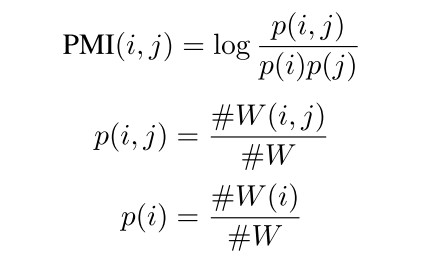
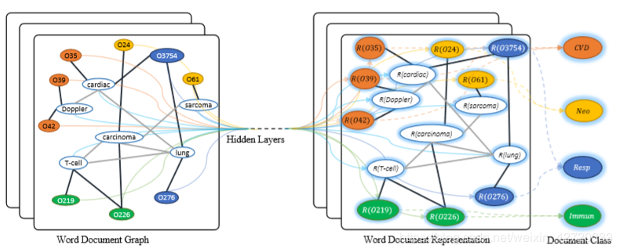

##  GCN文本分类(Text-GCN)
源自论文：Graph Convolutional Networks for Text Classification，https://arxiv.org/abs/1809.05679

Text-GCN可以捕获全局word之间的关联信息，并能高效利用有限的带标签doc信息。
### 1.语料处理
输入数据具体构建流程为：
* **节点特征矩阵：**首先我们将我们的文本语料构建拓扑图，图上的节点由文档和词汇组成，即图中节点数|v|=|doc|+|voc| 其中|doc|表示文档数，|voc|表示词汇总量。每个节点特征向量同维度都采用one-hot来初始化。
* **邻接矩阵：**边e=|doc-word edge| + |word-word edge|。doc-word边的权重，采用TF-IDF计算。word-word边的权重用固定大小滑窗在语料库中所有文档滑动统计词的共现信息，使用PMI(Point-wise Mutual Info)来计算。最终计算方式为，
$$
{A_{ij}} = \left\{ \begin{array}{l}
 {\rm{PMI}}\left( {i,j} \right)\quad \quad \quad \quad i和j是词语而且{\rm{PMI}}\left( {i,j} \right) > {\rm{0}} \\ 
 {\rm{TF - IDF}}\left( {i,j} \right)\quad \;\;i是文档j是词语 \\ 
 1\quad \quad \quad \quad \quad \quad \quad \;\;\;i = j \\ 
 0\quad \quad \quad \quad \quad \quad  \quad \;\;其他\\ 
 \end{array} \right.
$$
   PMI计算方式如下，其中#W(i)表示在固定滑动窗口下词汇i出现的数量，#W(i, j)表示在固定滑动窗口下词汇i，j同时出现的数量，当PMI(i, j)为正数表示词汇i和词汇j有较强的语义关联性，当PMI(i, j)为负数的时候表示词汇i，j语义关联性较低。

### 2.GCN模型
论文采用第三代GCN模型及与半监督节点分类设计完全相同，采用两层GCN，最终的前向网络模型为
$$
Z=f(X, A)=\operatorname{softmax}\left(\hat{A} \operatorname{ReLU}\left(\hat{A} X W^{(0)}\right) W^{(1)}\right)
$$
其中，
* $W^{(0)} \in \mathbb{R}^{C \times H}$为输入层到隐藏层的权重矩阵，隐藏层的特征维度为$H$
* $W^{(1)} \in \mathbb{R}^{H \times F}$为隐藏层到输出层的权重矩阵
* $\hat{A}=\tilde{D}^{-\frac{1}{2}} \check A \tilde{D}^{-\frac{1}{2}}$，$\check A=A+I$，$A$为邻接矩阵
实际流程如下图，图结构输入数据是将整个语料库中文档和单词当做图上节点来组成的特征矩阵X，这时我们的文本分类问题就转换为图上对文档节点的分类问题。

### 3.损失函数
将交叉熵损失函数作用于所有具有标签的语料节点作为模型的损失：
$$
\mathcal{L}=-\sum_{l \in \mathcal{Y}_{d}} \sum_{f=1}^{F} Y_{d f} \ln Z_{d f}
$$
其中$y_D$表示所有具备标签的语料，Ｆ为GCN输出节点的特征维度(与类别数相同)，$Y_{df}$为实际的标签矩阵，$Z_{df}$为模型的输出矩阵．

