### 图卷积神经网络——GCN

GNN模型主要研究图节点的表示（Graph Embedding），图边结构预测任务和图的分类问题，后两个任务也是基于Graph Embedding展开的。目前论文重点研究网络的可扩展性、动态性、加深网络。首先了解图结构是什么，最一般它是由节点和无向边构成的。在图卷积里，我们就处理这种简单的图结构，复杂的目前无法解决。

**GCN的四个特征：**

- GCN 是对卷积神经网络在 graph domain 上的自然推广
- 它能同时对节点特征信息与结构信息进行端对端学习，是目前对图数据学习任务的最佳选择。
- 图卷积适用性极广，适用于任意拓扑结构的节点与图。
- 在节点分类与边预测等任务上，在公开数据集上效果要远远优于其他方法。

　　图卷积神经网络的输入为拓补图，在一Convolution Layer里，对每个结点的邻居都进行一次卷积操作，并用卷积的结果更新该结点，则该节点具备其相邻节点及其自身的特征信息．在使用激活函数后可添加多个Convolution Layer构成深度神经网络．可将最终每个结点的状态转化为任务相关的标签用于分类任务，也可利用结点的信息得到整张图的表示．

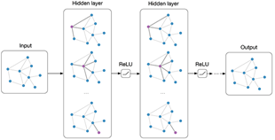

　　由于拓扑图中每个顶点的相邻顶点数目都可能不同，无法用一个同样尺寸的卷积核来进行卷积运算。GCN借助拉普拉斯矩阵来研究图的性质，通过傅里叶变换进行图上的卷积操作．
#### 1. 传统卷积与图卷积

CNN中的卷积本质上就是利用一个共享参数的过滤器（kernel），**通过计算中心像素点以及相邻像素点的加权和来构成feature map实现空间特征的提取**，当然加权系数就是卷积核的权重系数。

　　那么卷积核的系数如何确定的呢？是随机化初值，然后根据误差函数通过反向传播梯度下降进行迭代优化。这是一个关键点，**卷积核的参数通过优化求出才能实现特征提取的作用，GCN的理论很大一部分工作就是为了引入可以优化的卷积参数。**
　　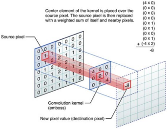

如图为应用在图像（欧式空间）和图（非欧式空间）的卷积区别。
其中可以看到，在图像为代表的欧式空间中，结点的邻居数量都是固定的；但在图中节点有多少邻居节点并不固定。
欧式空间中的卷积操作实际上是用固定大小的可学习的卷积核来抽取特征；而图邻居节点不固定，故不可以。**因此图卷积的本质是想找到适合图的可学习卷积核。**

#### 2. 图卷积
**图卷积方式主要分为两大类：空域卷积和频域卷积**。后续的任务实现以及相关学习都以频域卷积为主。
对于图结构表示成神经网络待输入的信息，图上每个节点都初始对应一个特征向量，通过网络学习，邻居节点信息的传递来更新节点的特征向量，也可以叫做节点的状态信息。

##### 2.1 空域卷积(Spatial Convolution)
空域卷积与深度学习卷积的应用方式类似，直接将卷积定义在每个节点的连接关系上，核心在于聚合邻居结点的信息。这种方式要直接在空域上对节点的相邻节点来操作，所有设计难点在于要定义拥有不同邻居数量的卷积操作。比如一种最简单的无参卷积方式可以是将所有直连邻居结点的状态信息加和，来更新当前结点的状态信息。

**消息传递网络(MPNN)：**
MPNN属于图神经网络GNN的一般性框架，它可以用在图上进行监督学习，我们空域卷积可以套用这个框架。模型包含两个过程：**信息传递阶段(message passing phase)**和**图读出阶段(readout phase)**。

* 信息传递阶段也就是前向传播阶段，它将空域卷积分解为：消息传递与状态更新操作，分别由$M_l ()$和$U_l ()$ 函数完成。M函数获取信息通过U函数更新节点，整个阶段循环运行T次，空域卷积对节点状态向量$h_v$的更新公式如下。
$\mathbf{h}_{v}^{l+1}=U_{l+1}(\mathbf{h}_v,\sum_{u{\in}ne[v]}M_{l+1}(\mathbf{h}_v^l,\mathbf{h}_u^l,\mathbf{x}_{vu}))$
其中，$l$代表图卷积的第l层，$x_{vu_{}}$表示相邻两节点边的特征向量(实际中采用的是邻接矩阵A)。
下图为MPNN示意图，比如对于B的邻居节点A,C在layer-0经过合适的卷积操作传递给B。

* 图读出阶段会计算一个特征向量用于整个图的表示。
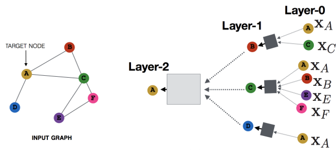

**图采样与聚合(GraphSage)**
MNPP框架下存在缺陷，卷积操作针对的是整张图，即输入整张图后才能卷积，不适用于大规模图。新方法利用**采样**部分节点方式来学习，也需要聚合邻居节点即**聚合操作**aggragate类似于MPNN中的消息传递过程。
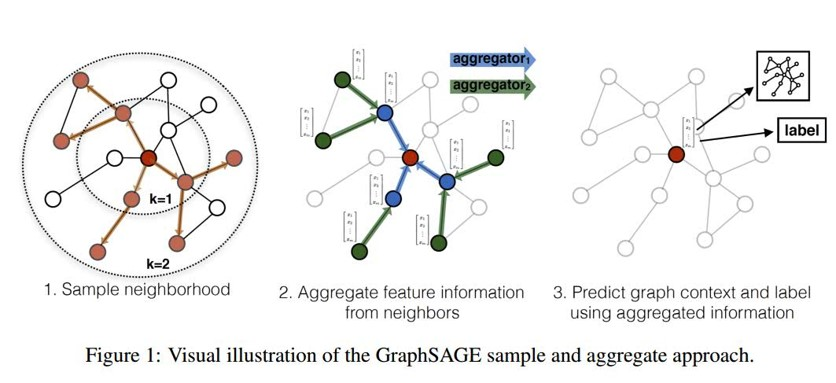
采样过程：

* 从图中随机采样若干个节点，个数为batch_size。对于每个节点，随机选择固定数目的邻居节点，构成进行卷积操作的图。
* 将邻居节点的信息通过aggregagte函数聚合起来更新刚才采样的节点。
* 计算采样节点处的损失。

状态更新公式为：
$\mathbf{h}_{v}^{l+1}=\sigma(\mathbf{W}^{l+1}\cdot aggregate(\mathbf{h}_v^l,\{\mathbf{h}_u^l\}),{\forall}u{\in}ne[v])$

aggregate函数可以是不带参的max,mean，也可以是带参如Lstm等神经网络。

**图结构序列化(PATCHY-SAN)**
采用将图结构转换成序列结构，然后直接利用卷积神经网咯在转化成序列结构上做卷积。论文中主要用于图的分类任务。
图结构转换成序列结构的难处：同构性质，产生序列要相似；邻居节点的连接关系，对应几阶邻接。
解决问题的步骤：
* 结点选择。该过程旨在与通过一些人为定义的规则(如度大的结点分数很高，邻居的度大时分数较高等)为每个结点指定一个在图中的排序。在完成排序后，取出前 $\omega$ 个结点作为整个图的代表。
* 邻居结点构造。完成结点排序后，以第1步选择的结点为中心，得到它们的邻居(这里的邻居可以是第一阶邻居，也可以是二阶邻居)结点，就构成了 $\omega$ 个团。根据第1步得到的结点排序规则对每个团中的邻居结点进行排序，再取前 k 个邻居结点按照顺序排列，即组成  $\omega$ 个有序的团。
* 图规范化。按照每个团中的结点顺序可将所有团转换成固定长度的序列(k+1)，再将它们按照中心结点的排序从前到后依次拼接，即可得到一个长度为$ {\omega}*(k+1)$ 的代表整张图的序列。之后可以使用Conv1D卷积，节点不足使用空节点填充。
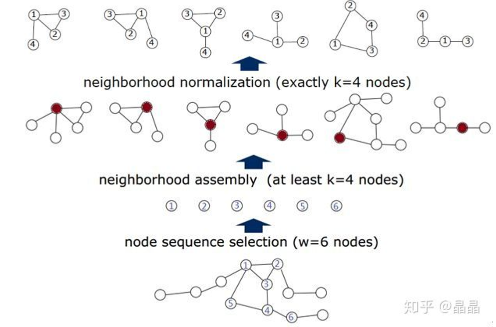

##### 2.2 频域卷积(Spectral Convolution)
空域卷积主要借鉴了图像的卷积操作，缺乏理论基础。而频域卷积不同，它主要利用图傅里叶变换实现卷积。

###### 2.2.1 前置内容
介绍频域卷积前，先引入重要前置内容。
**图相关矩阵的定义：**
度矩阵 $D$ ：只有对角线有值，为对应节点的度，其余为0
邻接矩阵$A$：有边连接的两节点间为1，其余为0
拉普拉斯矩阵常见有三种(**拉普拉斯矩阵的性质见附录1**) ：

  * $L=D-A$。
  * 归一化拉普拉斯矩阵：$L^{sys}=D^{-1/2}AD^{1/2}$
  * Random walk normalized Laplacian:  $L^{rm}=D^{-1}L$

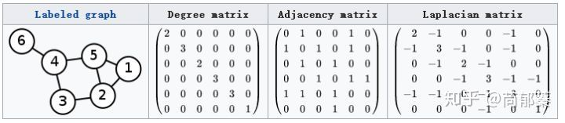
**卷积基本概念**
$$(f*g)(t)={\int}_{-\infty}^{\infty}f(\tau)g(t-\tau) d\tau(连续形式)$$
$$(f*g)(t)={\sum}_{\tau=-\infty}^{\infty}f(\tau)g(t-\tau) d\tau (离散形式)$$
它代表的意义，两个函数取g(x),把g(x)经过翻转平移,与f(x)相乘得到新的函数，再对函数积分。
**传统的傅里叶变换：**
傅里叶变换属于数字信号处理的重要算法，先给出基本定义以及它的变换公式：

  * 傅里叶变换会将一个空域(或时域)上定义的函数分解成频域上若干频率成分。(空域：像素域，每个像素点空间坐标内；频域：自变量是频率，纵轴是信号频率的幅度，图像灰度变化的程度，灰度梯度。)
  * $F(w) = \int_{-\infty}^{\infty}f(x)e^{-iwx}dx$  ，由$f(x)$变换到$F(w)$的结果，其中$i=\sqrt{-1}$  (**傅里叶变换见附录2**)

要想知道我们图卷积为什么要使用傅里叶变换，先看看它的意义：
* 在数字信号处理领域，傅里叶实现了从时域到频域的变换。根据原理我们知道，任何连续周期信号可以由多个的正弦曲线组合而成，可以说，傅里叶变换将原来难以处理的时域信号转化成频域信号。如下图，上为时域信号，下为频域信号，可以看到时域上很混乱而在频域图像非常规律，对于信号处理比如滤波等很轻易在频域实现。
  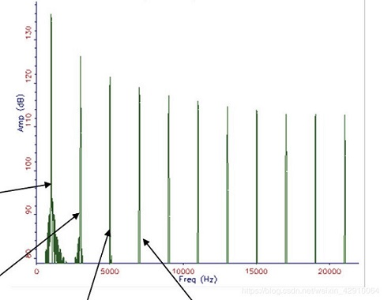
* 在图像领域，傅里叶变换实现了从空域到频域的变换。原始图像是在连续空间上采样得到一系列点的集合，比如我们用二维矩阵表示一个图像，经过傅里叶变换，我们能得到图像的频谱图。它代表着图像灰度变化的剧烈程度即灰度梯度，原始图像上颜色差异大，灰度梯度大的地方，对应到频谱图上的高频部分，显示出亮度强。如下图所示，这有利于图像的去噪等。
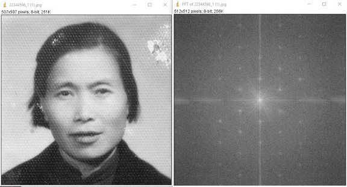

由上可以看到傅里叶变换可以化繁为简，让我们更好处理和分析原始数据，对于图结构也是如此。现在我们知道了基本卷积定义和傅里叶变换的原理，再介绍下卷积和傅里叶变换非常重要的关系：
$$
(f*g)(t)=F^{-1}[F[f(t)]{\odot}F[g(t)]]
$$
  上面是一个卷积恒等式，F表示傅里叶变换，$F^{-1}$表示傅里叶逆变换,$\odot$表示两个矩阵的逐点乘积。直观的说，就是 **空(时)域卷积等于频域卷积**。因此要计算f和g的卷积，可以先将它们通过傅里叶变换到频域，将两个函数相乘在通过傅里叶逆变换转换出来，得到卷积结果。

**总结：**
综上，我们知道了GCN的频域卷积的由来，就是因为原始图结构不好卷积，要利用傅里叶变换的频域卷积来等价实现图上卷积。

###### 2.2.2  推广到图的傅里叶变换

  傅里叶变换本质是将函数f(x)映射到了以$\{{\exp}^{-iwt}\}$为基向量的空间中。其中，对于这个傅里叶变换的基$e^{-i\omega t}$，是**拉普拉斯算子的特征向量(见附录1)**，$\omega$与特征值相关。
  而我们定义这个拉普拉斯算子目的其实就是为了找到傅里叶变换的基，这样若要将傅里叶变换推广到图，我们就需要用一个图上的"拉普拉斯算子"去寻找图的傅里叶变换的基，我们最后找到这个"拉普拉斯算子"就是我们之前介绍过的拉普拉斯矩阵，它也被叫做离散的拉普拉斯算子。(**至于传统傅里叶变换中的拉普拉斯算子到图上傅里叶变换的拉普拉斯矩阵，中间有详细的公式推导，见附录3**)

由上所述，我们找到了图上的拉普拉斯算子即拉普拉斯矩阵，所以图上傅里叶变换的基就是拉普拉斯矩阵的特征向量。而通过拉普拉斯矩阵求其特征向量的过程，就是**拉普拉斯矩阵的谱分解(见附录1)**，这也是频域卷积的核心。
最终，我们得出拉普拉斯矩阵$L$的特征向量$V$ ：$LV=\lambda V$。由拉普拉斯矩阵性质得到$L = U{\Lambda}U^{T}$，最后的U就是特征矩阵。

再回头看下传统傅里叶公式$F(w) = \int_{-\infty}^{\infty}f(x)e^{-iwx}dx$ ，原函数乘以基的积分形式。
根据离散积分就是内积形式，我可以得到图的傅里叶变换就是在特征值$\lambda_l$下的$f$与$\lambda_l$对应特征向量$u_l$的内积。
$F(\lambda_l)=\hat f(\lambda_l) = \sum_{i=1}^N f(i)u_l^*(i)$

其中，f是图上的N维向量，f(i)与图的节点一一对应，$u_l (i)$表示第$l$个特征向量的第i个分量。上述内积运算在复数空间定义，采用$u_l$的共轭$u^{*}_{l}$。
写成矩阵形式为：
$$
\left( \begin{array}{ccc} \hat f(\lambda_1) \\  \hat f(\lambda_2) \\ \vdots & \\ \hat f(\lambda_N) \\ \end{array} \right)  =
\left( \begin{array}{ccc}
u_1(1) & u_1(2) & \ldots & u_1(N) \\
u_2(1) & u_2(2) & \ldots & u_2(N) \\
\vdots & \vdots & \ddots & \vdots & \\
u_N(1) & u_N(2) & \ldots & u_N(N) \\   \end{array}
\right)
\left( \begin{array}{ccc}  f(1) \\   f(2) \\ \vdots & \\  f(N) \\ \end{array} \right)
$$
即$\hat f=U^Tf$

类似的，得到傅里叶逆变换为
$$
\left( \begin{array}{ccc}  f(1) \\   f(2) \\ \vdots & \\  f(N) \\ \end{array} \right)  =
\left( \begin{array}{ccc}
u_1(1) & u_2(1) & \ldots & u_N(1) \\
u_1(2) & u_2(2) & \ldots & u_N(2) \\
\vdots & \vdots & \ddots & \vdots & \\
u_1(N) & u_2(N) & \ldots & u_N(N) \\   \end{array}
\right)
\left( \begin{array}{ccc} \hat f(\lambda_1) \\  \hat f(\lambda_2) \\ \vdots & \\ \hat f(\lambda_N) \\ \end{array} \right)
$$
即$f=U \hat f$

###### 2.2.3 推广到图卷积：

我们再列出之前的卷积与傅里叶变换的关系式，两个函数分别傅里叶变换后点积再进行逆变换为：
$$
(f*g)(t)=F^{-1}[F[f(t)]{\odot}F[g(t)]]
$$
我们最终得到推广在图上的卷积：
$$
(f{*}_{G}g)=U(U^Tf{\odot}U^Tg)=U(U^Tg{\odot}U^Tf)
$$
我们把$U^Tg$整体看作可学习的卷积核$g_{\theta}$，表达形式就上面所讲矩阵形式的傅里叶变换，为了能和$U^Tf$进行点积，我们等价写成对角阵形式与$U^Tf$相乘，公式如下
$$
(f*h)_G = U \left( \begin{array}{ccc} \hat h(\lambda_1) & \\ &  \ddots & & \\ & & & \hat h(\lambda_N) \\ \end{array} \right) U^T f
$$
或
$o = (f*_{G}g)_{\theta} = Ug_{\theta}U^Tf$

###### 2.2.4 图卷积具体实现：

后面介绍图卷积为实际深度学习中应用的图卷积，现在主要应用的是第三代GCN。

**(1)** 第一代GCN：频域卷积网络(Spectral CNN)

源自论文：Spectral Networks and Locally Connected Networks on Graphs
, https://arxiv.org/abs/1312.6203

由上推导的$g_{\theta}$是首个提出的频域卷积神经网络的卷积核，即把直接把$diag(\hat h(\lambda_l))_{}$作为卷积核。

其中，对于$diag(\hat h(\lambda_l))$，这是深度学习的卷积要设计一个可训练的卷积核，我们对它变换为下面式子，这样不需要将卷积核再进行傅里叶变换，直接用这个变换后的参量学习。
$$
g_{\theta}(\Lambda)=
\left[
 \begin{matrix}
   {\theta}_1 & ... & 0 \\
   ... & ... & ... \\
   0  & ... & {\theta}_N \end{matrix}
  \right]
$$
最终的频域卷积层的更新状态为下式：
$y_{output}=\sigma (U g_{\theta}(\Lambda)U^Tx)$
其中，$\boldsymbol{x}$就是graph上对应每个节点的feature构成的向量，$x=\left(x_{1}, x_{2}, \ldots, x_n\right)$，然后经过激活之后，得到输出$\boldsymbol{y}_{\text {output}}$，之后传入下一层。

问题：
* 计算量大，每次卷积运算都要进行三个矩阵相乘，计算复杂度($O(N^3)$)
* 没有空间的局部性，每次卷积考虑所有节点
* 参数个数O(N)，而传统卷积只有常数

**(2)** 第二代GCN

源自论文：Convolutional neural networks on graphs with fast localized spectral filtering, https://arxiv.org/abs/1606.09375

将$\hat h(\lambda_l)$设计成了K阶多项式$\sum_{j=0}^{K} \alpha_j \lambda_l^j$ 。
其中公式展开如下
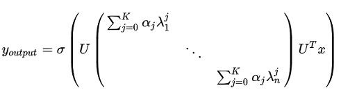
根据拉普拉斯矩阵性质，最终可将公式改写为(**详细推导见附录4**)：
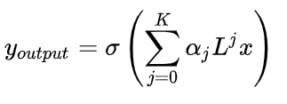
其中$(\alpha_1, \alpha_2, ...,\alpha_K)$是神经网络待学习的参数通过反向传播调整。这样设计卷积核的优点在于，

* 卷积核只有K个参数，一般K远小于n

* 矩阵经过变换后，不需要再对拉普拉斯矩阵做特征分解。当事先计算好$L^k$，每一步只需要向量与矩阵相乘，计算复杂度$O(KN^2)$。

* 卷积核具有很好的空间局部性。引入空间局部性这个来源于拉普拉斯矩阵性质，对于一个拉普拉斯矩阵，如果$d_G(m,n)>s$，则有$L_{m,n}^{s}=0$，其中$d_G(m,n)$为节点m,n的最短距离。也就是说当两节点距离超过s，拉普拉斯矩阵连乘超过s次，计算后的拉普拉斯矩阵中这两个节点的对应元素值为0。之后在与特征矩阵X进行乘积，节点的信息将不会传入下一层。因此，第二代GCN只考虑了K阶邻域。

此外，第二代GCN利用**切比雪夫多项式**(**见附录4**)的$K$阶截断来近似$L^k$，加快计算速度。

经过公式推导(**见附录4**)最终卷积公式为：
$$
\boldsymbol{y}_{\text {output}}=\sigma\left(\sum_{k=0}^{K} \theta_{k}^{\prime} T_{k}(\tilde{\boldsymbol{L}}) \boldsymbol{x}\right)
$$

其中，$T_k$比雪夫多项式第k项，$\tilde{\boldsymbol{L}}=\frac{2}{\lambda_{\max }} \boldsymbol{L}-\boldsymbol{I}_{n}$，$\boldsymbol{\theta}^{\prime} \in \mathbb{R}^{K}$为切比雪夫向量，$\theta_{k}^{\prime}$为第$k$个分量与之前的$\alpha$类似，为待学习参数。

**(3)** 第三代GCN

源自论文：Semi-Supervised Classification with Graph Convolutional Networks,https://arxiv.org/abs/1609.02907

第三代GCN直接取切比雪夫多项式K=1，即只考虑每个节点直接邻域的信息传递。

经过公式推导(**见附录5**)，最终带入卷积公式为，
$$
\underbrace{g_{\theta^{\prime}} * x}_{\mathbb{R}^{n \times 1}}=\theta\left(\underbrace{\tilde{D}^{-1 / 2} \tilde{A} \tilde{D}^{-1 / 2}}_{\mathbb{R}^{n \times n}}\right) \underbrace{x}_{\mathbb{R}^{n \times 1}}
$$

将该公式推广到多通道，即x由$N\times 1$变为$N\times C$，卷积核参数$\theta$由1维变为$C\times F$。其中，N,C,F分别代表节点个数，通道数，卷积核个数。
$$
\underbrace{Z}_{\mathbb{R}^{N \times F}}=\underbrace{\tilde{D}^{-1 / 2} \tilde{A} \tilde{D}^{-1 / 2}}_{\mathbb{R}^{N \times N}} \underbrace{X}_{\mathbb{R}^{N \times C}} \underbrace{\mathbf{\Theta}}_{\mathbb{R}^{C \times F}}
$$

这样，卷积核虽然只考虑到1阶邻域，但增加了卷积核个数堆叠成多层来增加感受野。这个也属于深度学习经验，增加深度比增加宽度效果好。

最终层级之间的传播公式为：
$H^{(l+1)} = \sigma(\check D^{-\frac{1}{2}} \check A \check D^{-\frac{1}{2}} H^{(l)} W^{(l)} )$
其中，

* $\check A=A+I$
* $\check D$是$\check A$的度矩阵，$\check D_{ii}=\sum_j \check A_{ii}$
* $H_l$是每第l层节点特征，输入层H0为X
* $W_l$为第l层可训练权重矩阵，对应之前的$\Theta$卷积核

##### 2.3 利用图卷积进行半监督节点分类

图卷积实现半监督节点分类属于上面介绍的第三代GCN中论文的实现部分。

论文主要考虑对图中节点进行分类，并且其中仅有一小部分节点有标签，这种问题被定义为图的半监督学习。实际问题中是考虑将引文网络数据集中的文档进行分类，其中数据集里包括每个文档稀疏的bag-of-words特征向量和文档与文档的引用标签列表，我们将两篇文档之间的引用看做无向边，构建为二元对称的邻接矩阵A。每个文档都有自己的一个类标签。

论文实际采用两层GCN，用来在图上进行半监督节点分类任务，最终的前向网络模型为
$$
Z=f(X, A)=\operatorname{softmax}\left(\hat{A} \operatorname{ReLU}\left(\hat{A} X W^{(0)}\right) W^{(1)}\right)
$$
其中，
* $W^{(0)} \in \mathbb{R}^{C \times H}$为输入层到隐藏层的权重矩阵，隐藏层的特征维度为$H$
* $W^{(1)} \in \mathbb{R}^{H \times F}$为隐藏层到输出层的权重矩阵
* $\hat{A}=\tilde{D}^{-\frac{1}{2}} \check A \tilde{D}^{-\frac{1}{2}}$，$\check A=A+I$，$A$为邻接矩阵

实际流程对应如下图，输入数据X为以所有文档为节点构成的特征矩阵，特征维度为C也就是词典大小(采用词袋模型)，经过维度为$C \times H$和$H \times F$的两次卷积，$H,F$是这两个卷积核的堆叠层数，其中$F$与类别数相同，得到$N \times F$维卷积结果$Z$。最终直接输入到softmax预测分类。
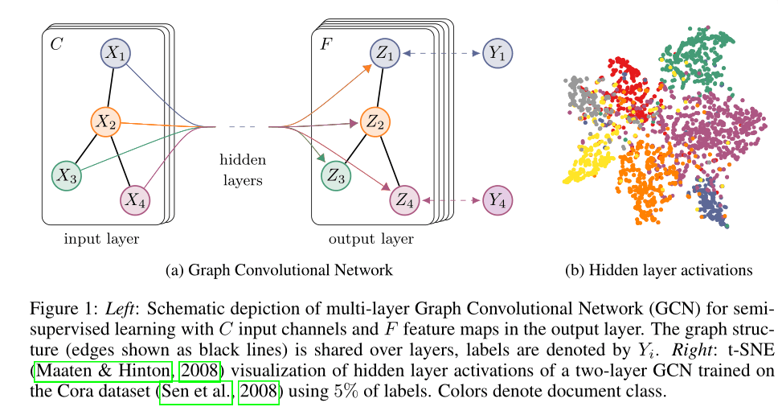

多类别交叉熵损失为，
$$
\mathcal{L}=-\sum_{l \in \mathcal{Y}_{L}} \sum_{f=1}^{F} Y_{l f} \ln Z_{l f}
$$
其中，$\mathcal{Y}_{L}$为带有标签的节点集合。

#### 附录

##### 1. 关于拉普拉斯矩阵性质和拉普拉斯算子
拉普拉斯矩阵具有许多良好性质，主要有三点：
* 拉普拉斯矩阵是对称矩阵，可以进行**特征分解（谱分解）**，这就和GCN的spectral domain对应
* 拉普拉斯矩阵只在中心顶点和一阶相连的顶点上（1-hop neighbor）有非0元素，其余之处均为0
* 通过**拉普拉斯算子**与拉普拉斯矩阵进行类比

**矩阵的谱分解，特征分解，对角化都是同一个概念**：属于线性代数内容，是将矩阵分解为由其特征值和特征向量表示的矩阵之积的方法。广义特征方程定义为$AV=\lambda V$，其中A是可以特征分解的矩阵，V是它$\lambda$特征值的特征向量。此外，矩阵要想可以谱分解，其充要条件为n阶方阵存在n个线性无关的特征向量。

对于拉普拉斯矩阵这个半正定矩阵，我们可知拉普拉斯一定可以谱分解，且分解具有特殊形式，分解公式如下。

$\mathbf{L} = \mathbf{U}  \left( \begin{array}{ccc} \lambda_1 & \ldots & \ldots \\ \ldots & \lambda_2 & \ldots \\   \vdots & \vdots & \ddots \\   \ldots & \ldots & \lambda_n \end{array} \right) \mathbf{U^{T}}$

**拉普拉斯算子**定义：拉普拉斯算子是n维欧几里德空间中的一个二阶微分算子，定义为梯度($∇f$)的散度($∇⋅f$，即$∇f⋅f$)。因此如果$f$是二阶可微的实函数，则f的拉普拉斯算子$Δ$定义为：
$∆f = ∇^2 f = ∇ \cdot ∇f$
$f$的拉普拉斯算子也是笛卡尔坐标系$xi$中的所有非混合二阶偏导数：
$∆f = \sum_{i=1}^n \frac{\partial^2 f}{\partial x_i^2}$
我们这里可以简单认为它就是二阶导。
例如$e^{-i\omega t}$满足，可以得出$e^{-i\omega t}$是$∆$的特征向量：
$$
\Delta e^{ i x \cdot v}=\lambda e^{ i x \cdot v}
$$
$$
e^{-i\omega t} = \frac{\partial  ^2}{\partial t ^2} e^{-i\omega t} = -\omega^2 e^{-i \omega t}
$$
##### 2. 关于傅里叶变换
首先认识下傅里叶级数，它是用一组sin,cos的函数来逼近的一个周期函数，那么每个sin，cos函数就是一组基，这组基上的系数就是频域，会发现随着频域越来越多（基越来越多），函数的拟合就越准确。
假设f(x)周期为T，则傅里叶级数可写作：
$$
f(x) = \frac{a_0}{2}+\sum_{n=1}^{\infty}(a_n cos(\frac{2 \pi nx}{T})+b_nsin(\frac{2 \pi nx}{T}))
$$
其中，
$$
a_n = \frac{2}{T} \int_{x_0}^{x_0+T} f(x) \cdot cos(\frac{2 \pi nx}{T})dx \\
b_n = \frac{2}{T} \int_{x_0}^{x_0+T} f(x) \cdot sin(\frac{2 \pi nx}{T})dx
$$
利用欧拉公式$e^{ix}=cos x+i sinx$，我们发现$cos x, sin x$可表示成，
$$
cos x = \frac{e^{ix}+e^{-ix}}{2} \\
sin x = \frac{e^{ix}-e^{-ix}}{2i}
$$
以上说的为周期函数，对于我们非周期f(x)，我们将它视为无穷大的周期函数即周期推广到$T=\infty$，就得到了傅里叶变换：
$$
F(w) = \int_{-\infty}^{\infty}f(x)e^{-iwx}dx
$$
##### 3. 关于传统傅里叶变换到图傅里叶变换
根据卷积原理，卷积公式可以写成
$$
f * g=\mathcal{F}^{-1}\{\mathcal{F}\{f\} \cdot \mathcal{F}\{g\}\}
$$
正、逆Fourier变换
$$
\mathcal{F}(v)=\int_{\mathrm{R}} f(x) e^{- i x \cdot v} d x
$$

$$
f(x)=\int_{\mathbb{R}} \mathcal{F}(v) e^{ i x \cdot v} d v
$$

已知一阶导数定义，使用一阶差分近似
$$
f^{\prime}(x)=\lim _{h \rightarrow 0} \frac{f(x+h)-f(x)}{h}=f(x+1)-f(x)
$$
拉普拉斯相当于二阶导数，同样近似等于二阶差分
$$
\begin{aligned} \Delta f(x)=\lim _{h \rightarrow 0} \frac{f(x+h)-2 f(x)+f(x-h)}{h^{2}}= f^{\prime}(x)-f^{\prime}(x-1)  &= f(x+1) - f(x) - (f(x) - f(x-1)) \\ &= f(x+1) + f(x-1) - 2f(x) \\ &= [f(x+1) - f(x)] + [f(x-1) - f(x)] \end{aligned}
$$
上面公式可以理解为**某个二阶导数等于其在所有自由度上微扰(即变化到某一方向)之后获得的增益**。这里一维函数自由度理解为2，为+1方向和-1方向，增益分别是$f(x+1)-f(x)$和$f(x-1)-f(x)$。总增益为所有方向增益的和。
同理对于图像而言，
$$
\begin{aligned} (\Delta f)_{x,y} &= \frac{\partial f(x,y)}{\partial x^2} + \frac{\partial f(x,y)}{\partial y^2} \\ &\approx f(x+1,y) + f(x-1,y) - 2f(x,y) + f(x, y+1)+f(x,y-1)-2f(x,y)  \\ & = f(x+1,y) + f(x-1,y) + f(x, y+1)+f(x,y-1)-4f(x,y) \\ &= [f(x+1,y) - f(x,y)]+[f(x-1,y) - f(x,y)]+[f(x,y+1) - f(x,y)]+[f(x,y-1) - f(x,y)] \end{aligned}
$$
这里可以看到有4个自由度(1,0)(0,1),(-1,0),(0,-1)，这形象说明拉普拉斯算子在图像上，在这4个自由度进行微小变化后获得的增益。

推广到图上，有个N个节点的图，邻接矩阵为A。这个图的自由度为N，因为我们可以把它当完全图考虑即任意两节点都有一条边（每个节点最大可以有N个方向的增益，至于有的节点间没有边，我们可以后面可以看到，可以人为设定为0）。
因此，这里函数f为一个N维向量，其中$f_i$表示在节点i的值(可以是特征向量)，类比图像f(x,y)为在(x,y)处的值。$\boldsymbol{f}$可以表示一张图。
$$
\boldsymbol{f} = (f_1, …, f_N)
$$
对于图，节点i向其相邻节点j变化的增益是$f_j-f_i$，不过通常写作负数$f_i-f_j$。再考虑边的权重(我们人为控制两节点是否有边，有为1，没有为0，其实就是邻接矩阵的定义)，增益可以表示为$w_{ij}(f_i-f_j)$。那么对于节点i，总的增益即为拉普拉斯算子在节点i的值：(后面把$j \in N_i$去掉因为存在非邻接点$w_{ij}=0$)
$$
\begin{aligned} (\Delta \boldsymbol{f})_i &= \sum_{j} \frac{\partial f_i}{\partial j^2} \\ & \approx  \sum_{j \in N_i} w_{ij} (f_i - f_j) \\ &=  \sum_{j} w_{ij} (f_i - f_j) \\ &= (\sum_{j} w_{ij}) f_i - \sum_j w_{ij} f_j \\ &=(\boldsymbol{D} \boldsymbol{f})_i - (\boldsymbol{A} \boldsymbol{f})_i \\ &= [(\boldsymbol{D} - \boldsymbol{A}) \boldsymbol{f}]_i \end{aligned}
$$

其中，上面假设$D$为$N\times{N}$的度矩阵(degree matrix)
$$
D(i, j)=\left\{\begin{array}{ll}{d_{i}} & {\text { if } i=j} \\ {0} & {\text { otherwise }}\end{array}\right.
$$
$A$为$N\times{N}$的邻接矩阵(adjacency matrix)
$$
A(i, j)=\left\{\begin{array}{ll}{1} & {\text { if } x_{i} \sim x_{j}} \\ {0} & {\text { otherwise }}\end{array}\right.
$$

最终图上的Laplacian算子作用在由图节点信息构成的向量$f$得到的结果等于图拉普拉斯矩阵和向量f的点积。
$$
\Delta f=(D-A)f
$$
因此我们最后将图上的拉普拉斯算子写为$\Delta=L=D-A$（从之前的二阶导形式变为矩阵与向量的乘积）

##### 4. 关于第二代GCN公式推导与切比雪夫多项式
(1)
已知将卷积核$\boldsymbol{g}_{\theta}(\Lambda)$定义为如下**k阶多项式**
$$
g_{\theta}(\mathbf{\Lambda}) \approx \sum_{k=0}^{K} \alpha_{k} \mathbf{\Lambda}^{k}
$$

将卷积公式带入并且由拉普拉斯矩阵性质，可以得到
$$
\begin{aligned} g_{\theta} * x & \approx U \sum_{k=0}^{K} \alpha_{k} \mathbf{\Lambda}^{k} \mathbf{U}^{T} \boldsymbol{x} \\ &=\sum_{k=0}^{K} \alpha_{k}\left(\mathbf{U} \mathbf{\Lambda}^{k} \mathbf{U}^{T}\right) x \\ &=\sum_{k=0}^{K} \alpha_{k}\left(\mathbf{U} \mathbf{\Lambda} \mathbf{U}^{T}\right)^{k} x \\ &=\sum_{k=0}^{K} \alpha_{k} \boldsymbol{L}^{k} x \end{aligned}
$$

(2)
已知任何k次多项式都可以使用**切比雪夫展开式**来近似，切比雪夫多项式$T_{k}(x)$使用递归的方式进行定义：

$T_{k}(x)=2 x T_{k-1}(x)-T_{k-2}(x)$
其中$T_{0}(x)=1, T_{1}(x)=x$。

设切比雪夫多项式第k项是$T_k$，频域卷积核计算方式：
$$
g_{\theta}(\mathbf{\Lambda}) \approx \sum_{k=0}^{K} \theta_{k}^{\prime} T_{k}(\tilde{\mathbf{\Lambda}})
$$
其中，$\tilde{\mathbf{\Lambda}}=\frac{2}{\lambda_{\max }} \mathbf{\Lambda}-\boldsymbol{I}_{n}$，$\boldsymbol{\theta}^{\prime} \in \mathbb{R}^{K}$为切比雪夫向量，$\theta_{k}^{\prime}$为第$k$个分量。
此时，带入到卷积公式
$$
\begin{aligned} \boldsymbol{g}_{\boldsymbol{\theta}} * \boldsymbol{x} & \approx \mathbf{\Phi} \sum_{k=0}^{K} \theta_{k}^{\prime} T_{k}(\tilde{\boldsymbol{\Lambda}}) \mathbf{\Phi}^{T} \boldsymbol{x} \\ 
&\approx \sum_{k=0}^{K} \theta_{k}^{\prime}\left(\mathbf{\Phi} T_{k}(\tilde{\mathbf{\Lambda}}) \mathbf{\Phi}^{T}\right) x \\
&=\sum_{k=0}^{K} \theta_{k}^{\prime} T_{k}(\tilde{\boldsymbol{L}}) \boldsymbol{x} \end{aligned}
$$
其中，$\tilde{\boldsymbol{L}}=\frac{2}{\lambda_{\max }} \boldsymbol{L}-\boldsymbol{I}_{n}$。

##### 5. 关于第三代GCN公式推导

已知切比雪夫多项式近似的卷积核
$$
g_{\theta}(\mathbf{\Lambda}) \approx \sum_{k=0}^{K} \theta_{k}^{\prime} T_{k}(\tilde{\mathbf{\Lambda}})
$$

令$\lambda_{max}=2, k=1$，得
$$
\begin{aligned} \boldsymbol{g}_{\boldsymbol{\theta}^{\prime}} * \boldsymbol{x} & \approx \boldsymbol{\theta}_{0}^{\prime} \boldsymbol{x}+\theta_{1}^{\prime}\left(\boldsymbol{L}-\boldsymbol{I}_{n}\right) \boldsymbol{x} \\ &=\boldsymbol{\theta}_{0}^{\prime} \boldsymbol{x}+\theta_{1}^{\prime}\left(\boldsymbol{L}-\boldsymbol{I}_{n}\right) \boldsymbol{x} \\ &=\theta_{0}^{\prime} \boldsymbol{x}-\theta_{1}^{\prime}\left(\boldsymbol{D}^{-1 / 2} \boldsymbol{A} \boldsymbol{D}^{-1 / 2}\right) \boldsymbol{x} \end{aligned}
$$

其中，归一化拉普拉斯矩阵$\boldsymbol{L}=\boldsymbol{D}^{-1 / 2}(\boldsymbol{D}-\boldsymbol{A}) \boldsymbol{D}^{-1 / 2}=\boldsymbol{I}_{n}-\boldsymbol{D}^{-1 / 2} \boldsymbol{A} \boldsymbol{D}^{-1 / 2}$。为进一步化简，$\theta=\theta_{0}^{\prime}=-\theta_{1}^{\prime}$,此时只有一个参数$\theta_{}$ ，
$$
g_{\theta^{\prime}} * x=\theta\left(I_{n}+D^{-1 / 2} A D^{-1 / 2}\right) x
$$
由于$\boldsymbol{I}_{n}+\boldsymbol{D}^{-1 / 2} \boldsymbol{W} \boldsymbol{D}^{-1 / 2}$的**谱半径$[0,2]$太大，在深度神经网络模型反复使用会导致数值不稳定（发散）和梯度爆炸/消失，因此使用归一化的trick**
$$
\boldsymbol{I}_{n}+\boldsymbol{D}^{-1 / 2} \boldsymbol{A} \boldsymbol{D}^{-1 / 2} \rightarrow \tilde{\boldsymbol{D}}^{-1 / 2} \tilde{\boldsymbol{A}} \tilde{\boldsymbol{D}}^{-1 / 2}
$$
其中，$\tilde{\boldsymbol{A}}=\boldsymbol{A}+\boldsymbol{I}_{n}$，$\tilde{D}_{i j}=\Sigma_{j} \tilde{A}_{i j}$。